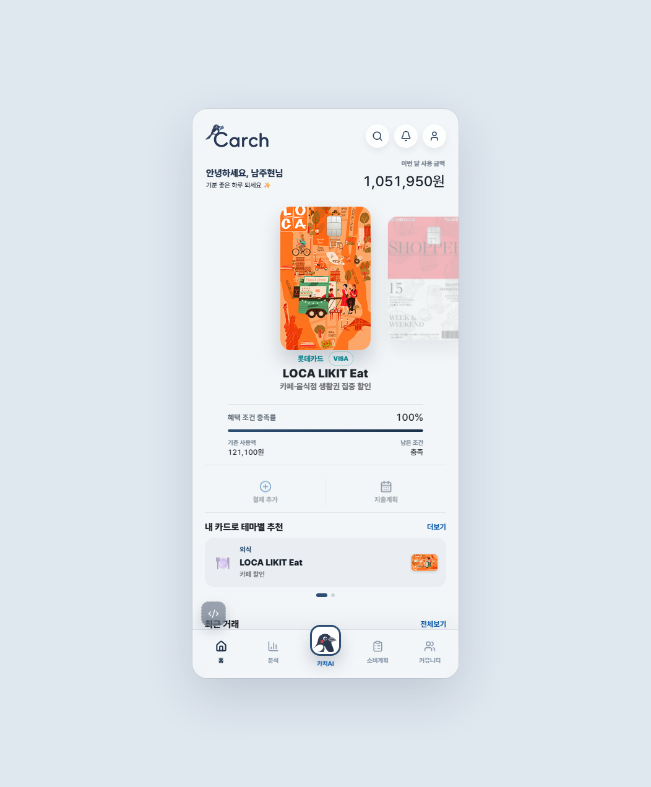
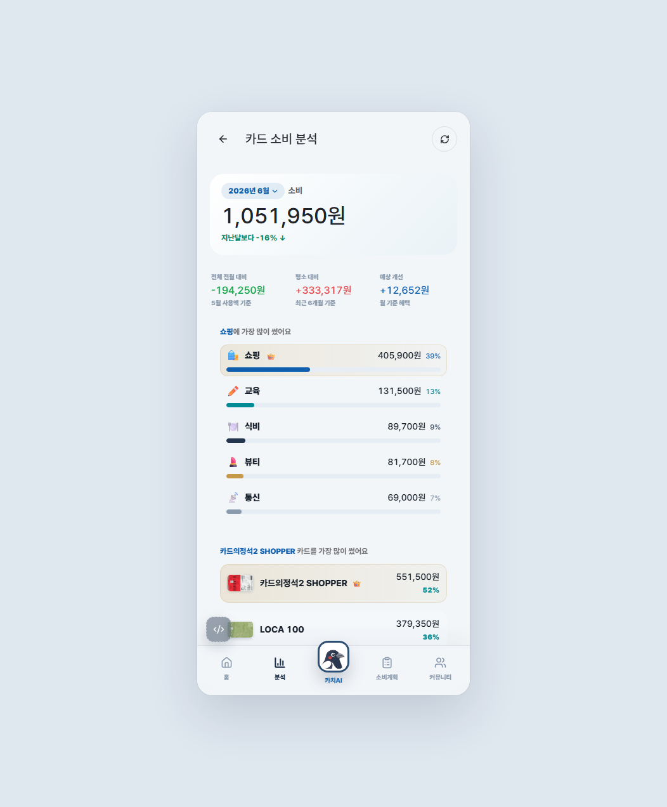
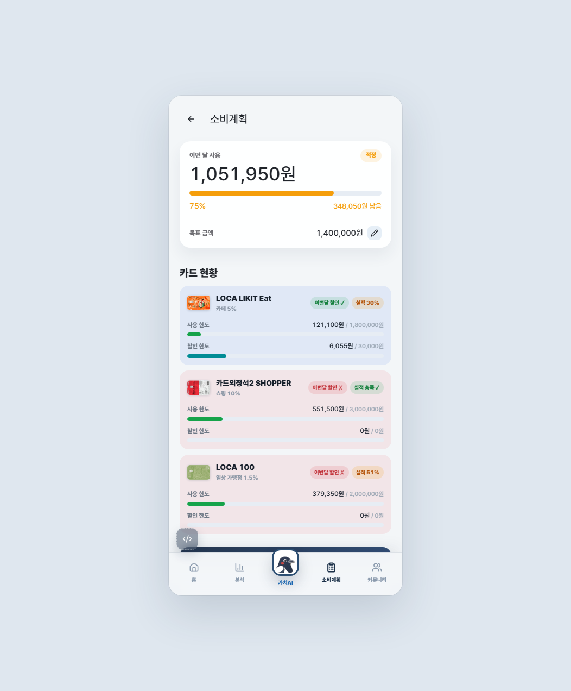
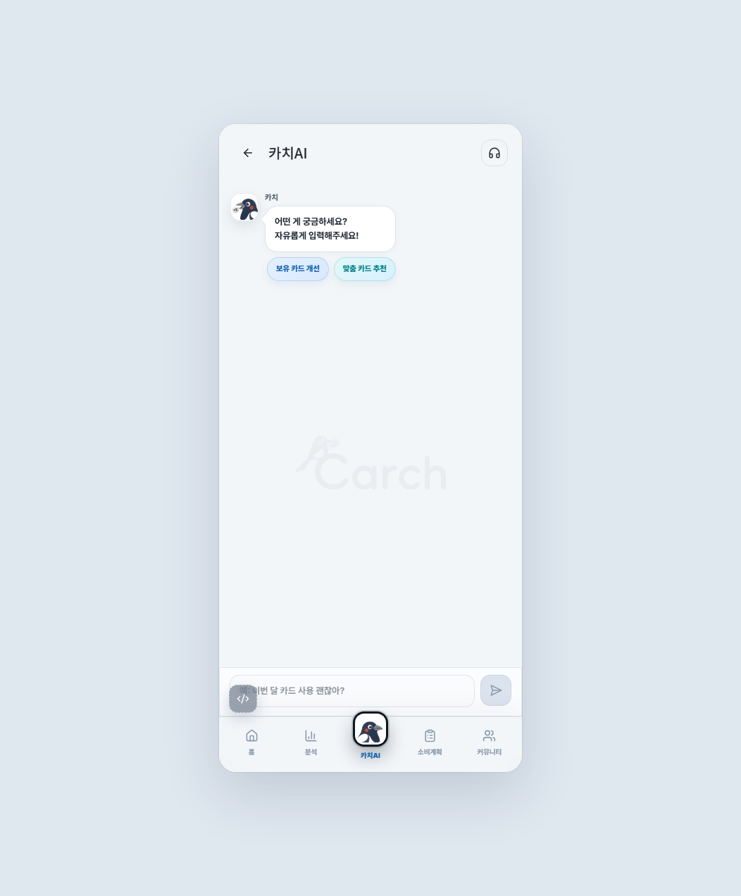
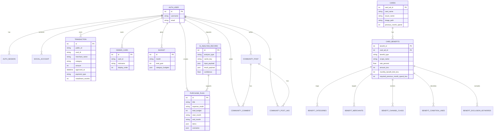

<div align="center">

# 💳 CARCH · 카치

### 보유 카드 혜택 최적화 & AI 소비 분석 서비스

**“어떤 새 카드를 발급할까?”가 아니라, “지금 가진 카드 중 무엇을 써야 가장 이득일까?”**
<br/>결제 전에 보유 카드의 혜택·실적·한도를 한 번에 계산해 *가장 유리한 한 장*을 추천하는 카드 소비 코치입니다.

[](https://carch-web.vercel.app)


</div>

---

## 📌 한눈에 보기

| | |
| --- | --- |
| **서비스명** | CARCH (CARD + CATCH) — 가진 카드에서 *새는 혜택을 잡는다* |
| **핵심 가치** | 결제 **전** 의사결정 · 보유 카드 **최적화** · 근거 있는 추천 |
| **차별점** | 신규 카드 발급 권유(X) → **보유 카드 최적 사용(O)** / 사후 통계(X) → **결제 전 설계(O)** |
| **AI 역할** | 계산·순위는 **룰 엔진**이, 해석·설명은 **생성형 AI**가 — 돈과 직결된 값은 AI가 만들지 않음 |
| **배포** | [carch-web.vercel.app](https://carch-web.vercel.app) (멀티유저, 회원가입 시 개인 지갑 생성) |

---

## 🖼️ 서비스 화면

| 카드 홈 | 소비 분석 | 소비계획 | 카치AI |
| :---: | :---: | :---: | :---: |
|  |  |  |  |

---

## 🎯 풀고자 한 문제

대부분의 사용자는 카드를 여러 장 갖고도 **결국 익숙한 한 장만** 씁니다. 이유는 명확합니다.

1. 시장은 *보유 카드 활용*보다 *새 카드 발급*을 권합니다.
2. 전월 실적·할인 한도·실적 제외 항목 등 **혜택 조건이 결제할 때마다 따지기엔 너무 복잡**합니다.
3. 기존 가계부/분석은 대부분 **사후 통계**라, 정작 결제 *전*에는 도움이 안 됩니다.

> CARCH는 “결제 후 보고서”가 아니라 **“결제 전 의사결정 도구”** 를 지향합니다.

---

## 🧠 핵심 설계 — “AI는 양 끝, 계산은 룰 엔진”

CARCH의 추천은 생성형 AI가 임의로 만들지 않습니다. **검증 가능한 룰 엔진**이 혜택·실적·점수를 결정론적으로 계산하고, AI는 입력 해석과 결과 설명이라는 **양 끝단**만 담당합니다.

```
사용자 (Vue 3 SPA)
        │  자연어 입력 / 결제 상황 / 소비계획
        ▼
┌────────────────────────────────────────────┐
│  Django 백엔드 — 룰 엔진 (Rule Engine)          │
│  • 전월 실적 · 월 한도 · 제외 조건 필터            │
│  • 즉시 혜택 + 실적 기여 − 기회비용 → 추천 점수     │
│  • 보유 카드 최적화 / 신규 카드 순가치 계산         │
└───────────────┬───────────────▲──────────────┘
   확정된 수치    │               │  검증된 카드 규칙 데이터
                ▼               │
┌────────────────────────────────────────────┐
│  FastAPI AI 프록시  →  GPT-4o-mini (GMS)       │
│  • 입력: 자연어 → JSON 구조화                    │
│  • 출력: 확정된 값만 받아 자연어 설명             │
│  • API 키 보호 · 입출력 검증 · 모델 교체 격리      │
└────────────────────────────────────────────┘
        ▲
        │  카드 상품 · 혜택 카탈로그 (정규화 규칙 스키마)
┌────────────────────────────────────────────┐
│  Supabase (PostgreSQL) + Storage              │
└────────────────────────────────────────────┘
```

**왜 이렇게 나눴나**
- **역할 분리**: LLM이 ‘돈 계산’을 못 하게 차단 → 환각이 결과를 오염시키지 않음
- **신뢰성**: 룰 엔진은 결정론적 → 같은 입력엔 항상 같은 결과 → 검증·디버깅 가능
- **교체 용이**: AI는 FastAPI 프록시 뒤에 있어 모델을 바꿔도 핵심 계산 로직은 그대로

---

## 🛡️ AI 가드레일 (3겹)

생성형 AI를 쓰면서 “AI가 틀리면?”에 대비해 **3단계**로 막았습니다.

| 단계 | 위치 | 역할 |
| --- | --- | --- |
| 프롬프트 | 시스템 프롬프트 | 역할·사용 가능 데이터·금지 행동·출력 형식·불확실 시 처리를 고정 |
| 프록시 | FastAPI | 클라이언트의 LLM 직접 호출 차단, 입출력·API 키 검사 |
| 코드 | Django 서버 | 허용되지 않은 카드·누락 필드·계산 불일치 시 **룰 기반 기본 문구로 자동 대체** |

> AI가 틀려도 **사용자 의사결정에는 영향을 주지 않도록** 설계했습니다.

---

## 🗄️ AI가 활용하는 데이터 (수집 · 전처리 · 관리)

| 단계 | 내용 |
| --- | --- |
| **수집** | 소셜 로그인(카카오·네이버) 후 사용자별 거래·보유 카드·예산, 자연어/영수증 입력. 카드 상품·혜택은 공식 데이터를 수집해 카탈로그화 |
| **전처리** | 자연어·영수증을 GPT가 금액·카테고리·카드로 **구조화(JSON)**, 카드 약관을 전월실적·할인율·한도·제외조건의 **규칙 스키마로 정규화** |
| **관리** | 멀티유저별 지갑 분리 저장(PostgreSQL), 카드 혜택을 *코드가 아닌 데이터*(규칙 DB)로 관리 → 카드 추가 시 **데이터만 추가**로 확장 |

카드 혜택 정규화 산출물은 [`backend/data/`](backend/data) 와 [`docs/DATASET_SUMMARY.md`](docs/DATASET_SUMMARY.md) 에서 확인할 수 있습니다.

---

## ⚙️ 추천 알고리즘

1. **소비 프로필 생성** — 거래내역을 월·카테고리·카드별로 집계, 이번 달/지난달/최근 평균 비교, 일시 지출과 반복 지출 분리
2. **혜택 규칙 매칭** — 카테고리·가맹점·결제 채널·제외 조건·전월 실적·월 한도를 정규화해 비교, 할부/무이자 등 제외 위험 결제는 감점·제외
3. **보유 카드 사용 추천** — 가진 카드만 대상으로 적용 가능 혜택 계산, “지금 바로 혜택 / 실적 채우면 다음 달 유리 / 혜택 제외 위험” 이유 코드 제공
4. **신규 카드 발급 추천** — 전월 실적·월 한도·연회비 월 환산을 반영한 **순가치**로, 보유 카드 대비 추가 이득이 있는 후보만 노출
5. **AI 설명 레이어** — 룰 엔진이 확정한 카드명·금액·조건·사유를 자연어로 설명 (보유 vs 신규를 명확히 구분)

> 핵심: *“지금 할인율이 가장 높은 카드”가 항상 1등은 아니다.* 한 번의 할인이 아니라 **한 달 전체 혜택**을 최적화합니다.

---

## ✨ 핵심 기능

- **카드 홈** — 보유 카드 캐러셀, 실적 충족률, 카테고리별 보유 카드 추천, 최근 거래
- **소비 분석** — 월별 총 소비, 전월/평균 대비 변화, 카테고리·카드별 비중, 예산 추이 (상단 요약 고정)
- **소비계획** — 예산 사용 현황, 반복 지출 판단, 큰 지출 계획 입력 → **카드별 분배안·예상 혜택** 계산
- **추천** — 보유 카드 개선 / 맞춤 카드 발급 분리, 혜택·한도·실적 조건 반영, 추천 사유 + AI 설명
- **카치AI** — 결제내역·보유 카드·소비계획을 컨텍스트로 한 자연어 상담, 화면 이동 연계
- **거래 입력** — “컴포즈 3,800원” 같은 자연어/영수증을 구조화해 등록, *추가 결과 실시간 미리보기*
- **커뮤니티** — 카드 후기·혜택 전략 게시글, 댓글·좋아요·저장, 검색

---

## 🧩 기술 스택

| 영역 | 기술 | 선택 이유 |
| --- | --- | --- |
| Frontend | Vue 3 · Vite · Vue Router · lucide | SPA로 대시보드·추천·계획 흐름을 빠르게 구성, 모바일 우선 UI |
| Backend | Django 5 · Django ORM | 금융 규칙을 *데이터로* 다루고 서버에서 **결정론적으로** 정확히 계산 |
| AI Gateway | FastAPI · Uvicorn | AI 전용 게이트웨이 — API 키 보호, 입출력 검증, 모델 교체 격리 |
| AI | GPT-4o-mini (SSAFY GMS, OpenAI 호환) | 계산이 아닌 *해석·설명* 전용 → 소형 모델로 비용·지연 최소화 |
| Data | Supabase PostgreSQL · Storage · 혜택 정규화 테이블 | 관리형 Postgres로 멀티유저·이미지·확장을 빠르게 |
| Auth | 토큰 세션 · 카카오/네이버 OAuth | 실제 멀티유저 서비스로 동작 |
| Deploy | Vercel | 서버리스 배포 |

---

## 🗂️ 프로젝트 구조

```
carch/
├── frontend/              # Vue 3 SPA
│   └── src/
│       ├── views/         # 19개 화면 (대시보드·분석·소비계획·추천·카치AI·커뮤니티 …)
│       ├── components/     # 화면 단위 컴포넌트
│       ├── services/       # api·auth·purchasePlans 등 API 연동 계층
│       ├── composables/    # 상태 로직 (usePurchasePlan 등)
│       └── data/ utils/    # mock·포맷·유틸
├── backend/
│   ├── api/                # Django 앱 — 모델·뷰·룰 엔진·시드·AI 프롬프트
│   ├── ai_proxy/           # FastAPI AI 프록시 (main.py)
│   ├── data/               # 카드 혜택 정규화 데이터셋
│   └── config/             # Django 설정
├── docs/                  # 명세·런북·데이터셋 요약·스크린샷
└── scripts/               # 실행 스크립트 (AI 프록시 등)
```

---

## 🚀 로컬 실행

```bash
# 1) Backend (Django 룰 엔진 API)
cd backend
pip install -r requirements.txt
python manage.py migrate
python manage.py runserver            # http://127.0.0.1:8000

# 2) AI Proxy (FastAPI) — .env에 GMS/OpenAI 키 설정
uvicorn ai_proxy.main:app --reload --port 8001
#   (Windows: ../scripts/run_ai_proxy.ps1)

# 3) Frontend (Vue 3)
cd ../frontend
npm install
npm run dev                           # http://127.0.0.1:5173
```

> 개발 편의용 `/dev` 라우트에서 모든 화면으로 바로 이동할 수 있습니다(로컬 전용).

---

## 🗃️ 데이터베이스 모델링 / ERD

서비스 데이터는 Django 모델로 관리하고, 카드 상품·혜택 카탈로그는 Supabase에 정규화된 별도 테이블로 관리합니다.



---

## 👥 팀원 & 역할

> 2인 풀스택 협업 — 기획·프론트·백엔드·데이터·AI 연동·배포를 함께 맡고, 강점 영역을 나눠 리드했습니다.

| 팀원 | 역할 | 주요 기여 |
| --- | --- | --- |
| **남주현** · Full-stack | 프론트엔드 리드 · 데이터 | • Vue 3 SPA 전체(19개 화면) UI/UX 설계·구현<br/>• 카드/소비분석/소비계획/카치AI 화면 고도화 및 인터랙션<br/>• **카드 혜택 데이터 수집·정규화 및 규칙 스키마 설계**<br/>• **거래·카드 시드 데이터 구축, 추천 결과 검증·데모 시나리오 QA**<br/>• 프론트 API 연동 계층 정비 |
| **조성익** · Full-stack | 백엔드 리드 · AI/인프라 | • Django 룰 엔진 추천 로직 · 데이터 모델링<br/>• FastAPI AI 프록시 및 GMS(GPT) 연동·가드레일<br/>• Supabase(Postgres)·Storage 연동, 인증/세션<br/>• 일부 프론트 연동(서비스 계층·상태) 협업<br/>• Vercel 배포 및 환경 구성 |
| **공통** | 기획 · 검증 | 서비스 기획, 테스트(E2E 점검), 발표 시나리오, 문서·산출물 정리 |

---

## 🔗 링크

- **배포(Live)**: https://carch-web.vercel.app
- **서비스 명세**: [docs/SERVICE_SPEC.md](docs/SERVICE_SPEC.md)
- **데모 런북**: [docs/DEMO_RUNBOOK.md](docs/DEMO_RUNBOOK.md)
- **데이터셋 요약**: [docs/DATASET_SUMMARY.md](docs/DATASET_SUMMARY.md)
