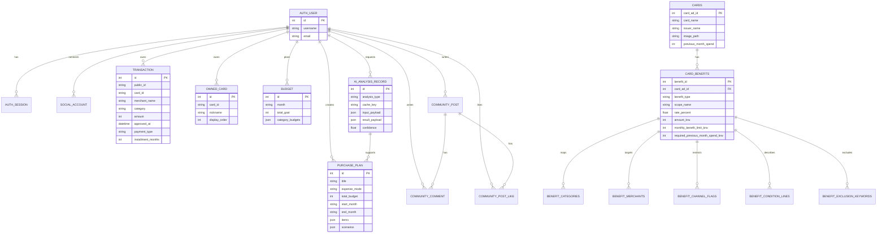

# CARCH 카치

카치는 사용자의 결제내역, 보유 카드, 카드 혜택 조건, 소비계획을 함께 분석해
“지금 가진 카드 중 무엇을 쓰면 좋은지”와 “새 카드를 발급할 가치가 있는지”를
분리해서 안내하는 카드 소비 코치 서비스입니다.

## 1. 팀원 정보 및 업무 분담

| 팀원 | 주요 업무 |
| --- | --- |
| 남주현 | 프론트엔드 UI/UX, 카드 메인 화면, 소비계획/분석/카치AI 화면 고도화, 데모 시나리오 검증 |
| 조성익 | 백엔드 API, 데이터 모델링, 카드 혜택 데이터 정제, 추천 로직, GMS AI 연동, 배포 구조 정리 |
| 공통 | 서비스 기획, 테스트, 발표 시나리오, README 및 산출물 정리 |

## 2. 목표 서비스와 실제 구현 정도

### 목표

- 카드별 혜택 조건을 사용자가 직접 비교하지 않아도 되도록 자동 분석합니다.
- 실제 결제내역을 기반으로 보유 카드 사용 전략을 제안합니다.
- 소비 패턴상 유의미한 이득이 있을 때만 새 카드 발급 추천을 분리해서 제안합니다.
- 예산, 지출계획, 카드 추천이 하나의 소비 관리 흐름으로 이어지도록 구성합니다.
- 생성형 AI는 추천 결과를 임의로 만들지 않고, 계산된 결과를 사용자가 이해하기 쉽게 설명합니다.

### 구현 완료

- 이메일/데모 로그인 및 세션 인증
- 카드 목록, 카드 상세, 보유 카드 추가/삭제
- 거래내역 목록, 상세, 직접 입력, 삭제
- 월별 소비 분석, 카테고리/카드별 소비 집계
- 소비계획 화면, 월 예산, 반복 지출 판단, 새 카드 추천 패널
- 보유 카드 사용 추천과 새 카드 발급 추천 분리
- 카치AI 채팅 UI 및 GMS 기반 응답
- 커뮤니티 게시글/댓글/좋아요
- Supabase 카드 카탈로그 연동 및 Supabase Storage 카드 이미지 연동
- Vercel 배포

## 3. 기술 스택

| 영역 | 사용 기술 |
| --- | --- |
| Frontend | Vue 3, Vite, Vue Router, lucide-vue-next |
| Backend | Django 5, Django ORM |
| AI | SSAFY GMS OpenAI-compatible API |
| Data | Supabase Postgres, Supabase Storage, 카드 혜택 정규화 테이블 |
| Deployment | Vercel |

## 4. 데이터베이스 모델링 / ERD

서비스 데이터는 Django 모델을 중심으로 관리하고, 카드 상품/혜택 카탈로그는
Supabase에 정규화된 별도 테이블로 관리합니다.

## 5. 추천 알고리즘 기술 설명

카치의 추천은 생성형 AI가 임의로 만드는 방식이 아니라, 백엔드의 규칙 기반 계산 결과를
먼저 만들고 AI는 그 결과를 자연어로 설명하는 구조입니다.

1. **소비 프로필 생성**
   - 로그인 사용자의 거래내역을 월별, 카테고리별, 카드별로 집계합니다.
   - 이번 달, 지난달, 최근 평균 사용액을 비교해 소비 변화와 주요 카테고리를 계산합니다.
   - 일시 지출과 반복 가능 지출을 분리해서 카드 추천에 반영합니다.

2. **혜택 규칙 매칭**
   - 카드 혜택의 카테고리, 가맹점, 결제 채널, 제외 조건, 전월 실적, 월 한도를 정규화해 비교합니다.
   - 거래 카테고리와 카드 혜택 범위가 맞는지 확인합니다.
   - 할부/무이자 할부처럼 혜택 제외 가능성이 있는 결제 조건은 별도 감점 또는 제외 처리합니다.

3. **보유 카드 사용 추천**
   - 사용자가 이미 가진 카드만 대상으로 현재 지출에 적용 가능한 혜택을 계산합니다.
   - 현재 혜택 가능 카드와 다음 달 실적 준비용 카드를 구분합니다.
   - “지금 바로 혜택”, “실적을 채우면 다음 달 유리”, “혜택 제외 위험” 같은 이유 코드를 함께 제공합니다.

4. **새 카드 발급 추천**
   - 전체 카드 후보를 대상으로 예상 월 혜택을 계산합니다.
   - 전월 실적 조건, 월 한도, 연회비의 월 환산액을 반영합니다.
   - 보유 카드 대비 추가 이득이 있는 후보만 우선순위로 노출합니다.

5. **AI 설명 레이어**
   - 백엔드가 계산한 카드명, 금액, 조건, 추천 사유를 바탕으로 사용자에게 자연어 설명을 제공합니다.
   - 보유 카드 사용 추천과 새 카드 발급 추천을 명확히 구분해 안내합니다.

## 6. 핵심 기능

### 카드 홈

- 보유 카드 캐러셀
- 카드별 실적 충족률
- 카드 상세 진입 및 삭제
- 카테고리별 보유 카드 추천
- 최근 거래내역 확인

### 소비 분석

- 월별 총 소비
- 전월/평균 대비 변화
- 카테고리별 소비 비중
- 카드별 사용액
- 예산 사용 추이

### 소비계획

- 이번 달 예산 사용 현황
- 반복 지출 후보 판단
- 지출계획 입력
- 새 카드 추천과 연결

### 추천

- 보유 카드 개선 추천
- 맞춤 카드 발급 추천
- 혜택 조건, 월 한도, 전월 실적 조건 반영
- 추천 결과에 대한 AI 설명

### 카치AI

- 카카오톡형 말풍선 UI
- 보유 카드 개선/맞춤 카드 추천 빠른 질문
- 사용자의 결제내역, 보유 카드, 소비계획 컨텍스트 기반 답변
- 대화 상태 유지 및 관련 화면 이동 지원

### 커뮤니티

- 카드 후기와 혜택 전략 게시글
- 댓글, 좋아요
- 검색 연동

## 7. 생성형 AI 활용 부분

- **거래내역 입력 보정**: 사용자가 자연어로 입력한 결제 내용을 구조화합니다.
- **소비계획 분석**: 큰 지출 계획을 항목/기간/예산으로 정리하고 카드 사용 시나리오를 생성합니다.
- **카드 추천 설명**: 규칙 기반 추천 결과를 사용자가 이해하기 쉬운 문장으로 설명합니다.
- **카치AI 상담**: 최근 결제내역, 보유 카드, 소비계획을 컨텍스트로 받아 짧고 실용적인 답변을 생성합니다.

## 8. 배포 URL

[https://carch-web.vercel.app](https://carch-web.vercel.app/community)
